## 👋 Introduction
In this lesson we’re talking about creating locations to draw. This includes everything from creating the ideas to laying out the place and thinking about how to fill it with life. This lesson is sort of a concept art boot camp for environments, and you may want to re-visit it later. Let's get stuck in.

### Learning objectives
With this lesson, you’ll:
- Learn how to create interesting concepts.
- Learn how to take a concept and flesh it out.
- Gain tools and techniques to make those concepts are as good as they can be.

### Approaches to concepting
Making an interesting locations and backgrounds is all about providing context without having to rely on exposition. That means giving the viewer information without using text. Your goal is to create a space that, on its own, tells the viewer all they need to know.

You can dive straight into the sketching and images, start with text to focus on the ideas first – it's all up to you. Collecting references to inspire you or use as jumping-off points is also a good way to start.

We'll focus on this approach:

1. **Definition:** Clearly define what the location is/does.
2. **Exploration:** Start thumbnailing to explore the location.
3. **Add interest:** While thumbnailing, look at reference, answer questions, and add more interest.
4. **Refine:** Choose which thumbnails work best and refine.
5. **Layout:** Create a layout sketch based on your thumbnails.
6. **Review:** Check your details and review this location.
7. **Tie down:** Create your final concept art.

---

This is a very general approach. You may find that you prefer to re-arrange these steps or go about it your own way, and that's fine. But this has all the core steps you need to create interesting location concepts.

## 🤔 Coming up with interesting concepts
The main creative step when it comes to concepting is to, well, come up with the concepts.

Some people are able to just take a page and start sketching out ideas! But for those of us who are left staring at a blank page, let’s go through the steps above to help get those creative juices flowing.

### Define the problem space
Let’s ask ourselves some questions to help nail down what we’re doing:

---

**Q:** What are we coming up with concepts for? 
**A:** Well, this is a course about backgrounds and locations… so we’re coming up with ideas for a location right now.

**Q:** How will the concept be used? 
**A:** Well, this location could be part of an establishing shot that we’ll see for half a second, a set (e.g. a character’s home / work / area of interest), a connecting location between existing places… We’ll say this is a character’s home.

**Q:** What is the character like? 
**A:** She’s a unicorn that enjoys looking at the stars! And maybe she lives in a… tower or something?

**Q:** What’s the world like? 
**A:** Hmm… really round and, um. Maybe there’s a lot of plants around? 😓

---

You can definitely start sketching out some concepts with this much information. Or even less!! (if you’re working out how the world should feel, or how a character should look, you’ll often just start off with some ideas for a possible story and go from there).

### Initial concepting
And now we can jump onto the page to start working out ideas!

At this stage you should really be focusing on **thumbnails.** These are small sketches that are really quick and easy to complete. We’re trying out a bunch of different ideas here, so one of the main things that’ll help is being able to iterate quickly. You’ll be tossing out ideas that don’t work and trying out new ones that pop into your head.

The thumbnails at this stage don’t need to look good, or be complete, or even be something that someone else would look at and like. They just need to get ideas down and be readable enough for you to understand and see what’s going on. If you can see what’s happening, and decide how much you like the concept, you’re going well.

At this stage, keeping your thumbnails in greys (no colours) can help a lot. It’ll keep you working faster and help you focus on the values, which can stay the same no matter what colour scheme you decide to go for with the final piece.

---

Let’s see what one of our [skilled artist friends OJ](https://twitter.com/ahappypichu/) comes up with from the above:

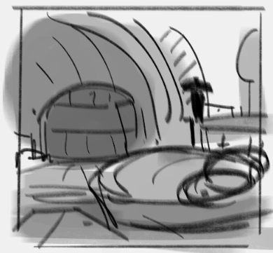

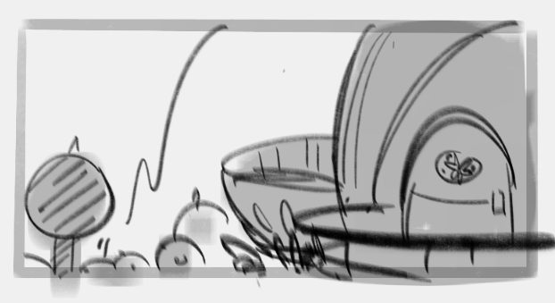

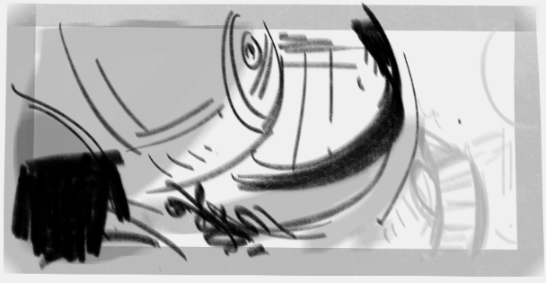

Ooh, very cool! An internal shot and a couple of external shots. We like the direction these are going in, so let’s try fleshing this concept out.

When you’re doing this you’ll want to sketch out a number of thumbnails like the above, with different ideas and concepts These should be quick enough that you can draw a bunch. Once you have a set of thumbnails, you can choose which ones are the most interesting to iterate on and refine!  

### Adding more interest
Coming up with concepts is great, but we want to come up with **interesting** concepts!!

There are a lot of ways to add interest while we’re concepting. A lot of it comes from years of experience trying stuff out and seeing what works, what doesn’t, and refining your design taste… but right here, we’ve got some special tips, tricks, and extra questions for you to think about:

---

  
📚 Create more thumbnails

  

The more thumbnails you sketch, the more you’ll be able to explore different ideas! And the more that your head will stray away from the tried-and-true standard ideas that we all tend to think of first.

So, just: do more thumbnails, and **let yourself explore different takes on the concept** with those thumbnails. The more you can explore at these early stages – when exploration is quick and easy – the more ideas you’ll be able to choose from.
  

  
🫳 How does your location interact with the surrounding environment?

  

Will your structure stand out from the surroundings or blend into them? Is the structure on a cliff? Maybe there’s a bunch of round trees surrounding the building, while the building itself is very tall and sharp?

All of these questions – and especially whether the structure is **cohesive or contrasting** compared to the surroundings – can introduce some real interest into your designs.

And, all of these things can be worked out with thumbnails! Since these are big-picture questions and elements, they’ll be readable even when drawn at a small scale.

---

Take a look at [Chang-Wei Chen’s work](https://www.artstation.com/willischen) for inspiration, and you can see his process for figuring out a location in this example:

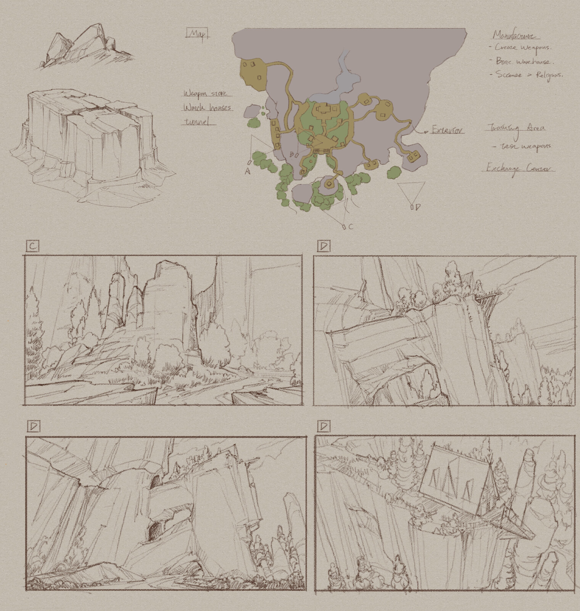
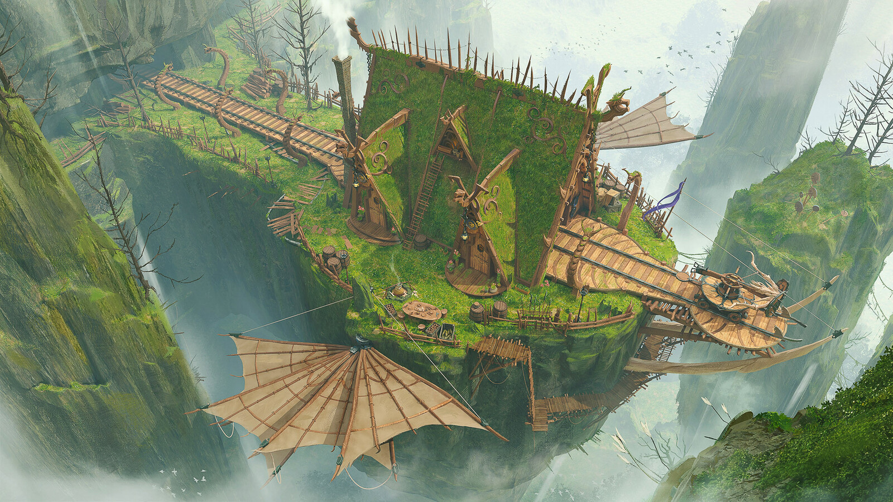
  

  
🔎 Provide more context

  

The design provides context without relying on exposition. Every single element you include explains something, or provides more information about the location or about the people that frequent it.
 
With that in mind, think about extra info or elements that could be fun to include. Or draw new elements (like maybe a pair of wings on either side of a house) and then try to explain them!! See if you can pull them into your design and help it make sense.
  

  
📸 Real life references

  

You can find pictures and videos of all kinds of weird, wonderful, and interesting places! Especially with [YouTube](https://www.youtube.com/) and [Bing](https://www.bing.com/images/trending), you can search any term you want and find a variety of places to reference for your concept.

Look for places like your location (e.g. ‘nuclear reactor’ if you’re making a reactor), places unlike your places, or you can just search for feelings or random terms and see what comes up. With the internet, there’s a lot at your fingertips so long as you have the patience to go searching for it.

And then toss the references into [PureRef](https://www.pureref.com/) (free download $0) so you can look at ‘em later on.
  

  
🧩 Shared design elements

  

There are a ton of series out there that feature prominent design elements. For example, Half Life’s iconic lambda symbol, the almost divine imagery in Steven Universe, or the symbology that’s embedded all over the place in Gravity Falls.

Do you have any similar elements that you can include in your own locations? Any design features or shapes that certain characters or ‘sides’ or mythologies inside your universe uses? If your universe has these, including them across your designs can help reinforce the lore of the world in interesting ways.
  

  
🌍 Think about the world (ship, universe, etc) around your location

  

If you haven’t already, try thinking about the world that your location’s on. Maybe there are special elements, like the water being green or there being two suns? Maybe it’s an extremely hot climate, or a wet one.

The more you think about the world itself, the more that you’ll be able to think about how your location fits into and contrasts with that world!
  

  
✨ Treat the location like a character, not a static backdrop

  

Every character in a universe has their own goals, ambitions, and history. In exactly the same way, every location has its unique history, gets used by people in different ways, and may have been designed or left to nature.

You locations are living, breathing places. Or, maybe they **once** were and aren’t anymore. Thinking about them in this kind of way can help you get more invested in what you’re designing (I know that it’s hard for me to really put effort into designing a place if I approach it like it’s just some unimportant hallway in the middle of nowhere – so hopefully this helps!).
  

  
📜 What’s the history of the location?

  

This place has history. What was it like 50 years ago? 100? Is it newly-built, has it been lived-in for ages? What kinds of events have been held there? Is it a place that’s highly regarded, or was by a peoples that were around long ago? Or is it a nondescript piece of the urban landscape that nobody (except those that live nearby) would give a second glance?

Is there some **hidden** element to the place, or is everything as it appears? When the place was being built (if it’s constructed), did the people building it put in a lot of effort or very little?
  

---

There are a million questions you can ask about a place, and its history, to get more context and to get more interesting ideas to sketch with. Hopefully some of these ideas help!

## 🦋 Refining your concept
So you’ve got a thumbnail (or a few) that work really well! Now it’s time to take that concept and turn it into something you can use in your story and draw backgrounds from.

### Combine ideas
You (probably) sketched up more than one concept or take on the location. Try looking through the rejected ones to see if there’s any fun, interesting, or useful ideas you can steal from those to add into this concept!

### Try sketching the actual layout
If the location is something like a set, you’ll want a clear idea of how the location is laid out and how it all works. Making a top-down layout of your location (or other kinds of planning shots) will help you later on when you want to draw tied-down images of it.

---

Let’s take [OJ’s](https://twitter.com/ahappypichu/) concept from above and see one of the layout drawings he’s made of it:

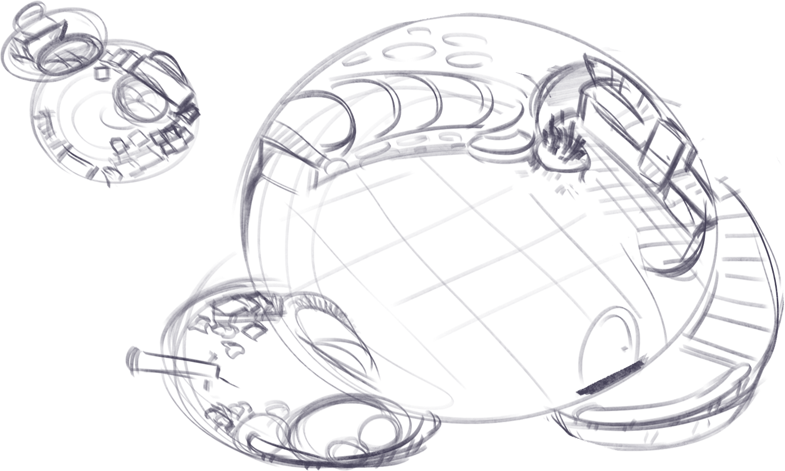

In this layout you can see the main living area on the right – complete with a kitchen, a balcony with a telescope, and some stairs heading up. On the left, you can see a small bedroom slash study, which looks like an interesting area.

**Examples**
Let’s look at some example location and layout images:

  
☢️ Half Life

  

One of the interesting things with Half Life’s concept/planning art is the different levels of quality in there. I’m also a fan of the tied-down images below having little layouts in the corner – it’s an interesting way of combining the layout and tied-down images.

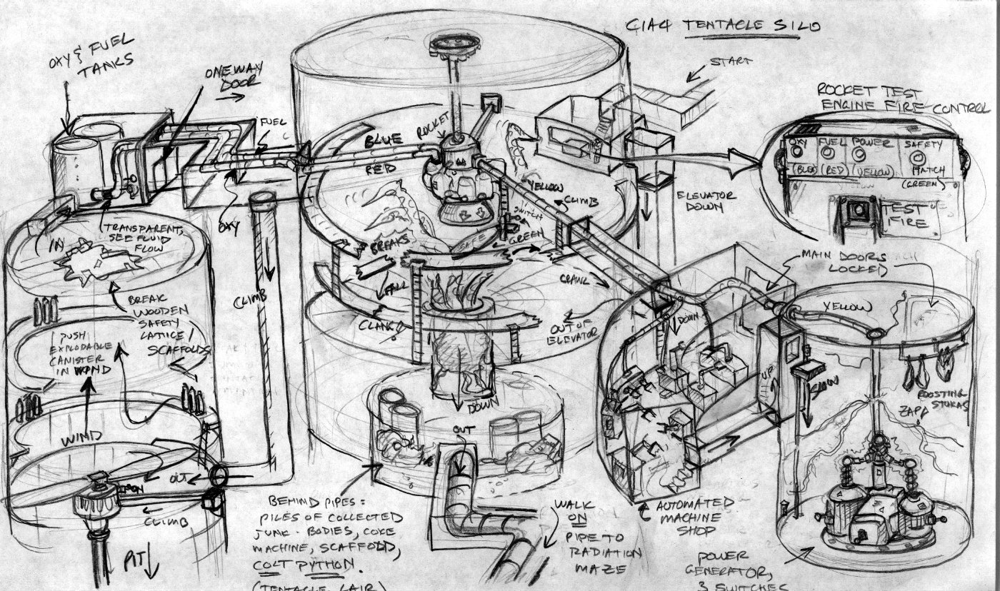
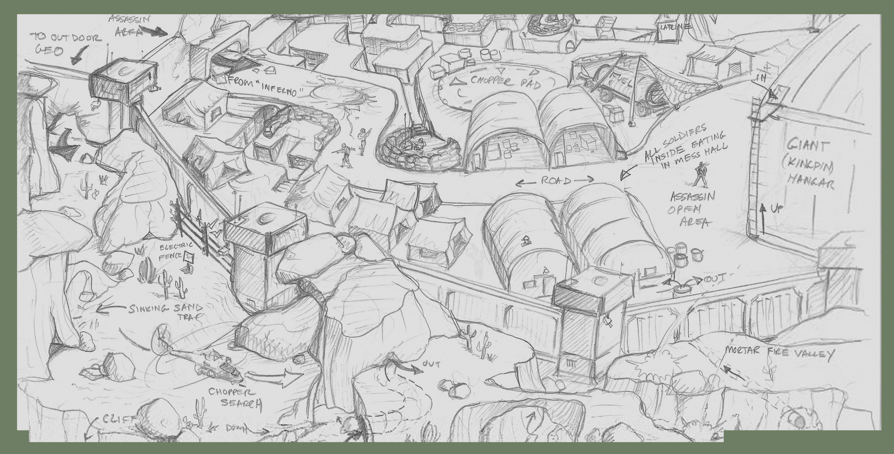
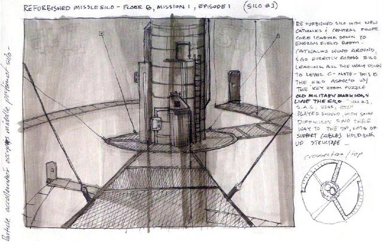
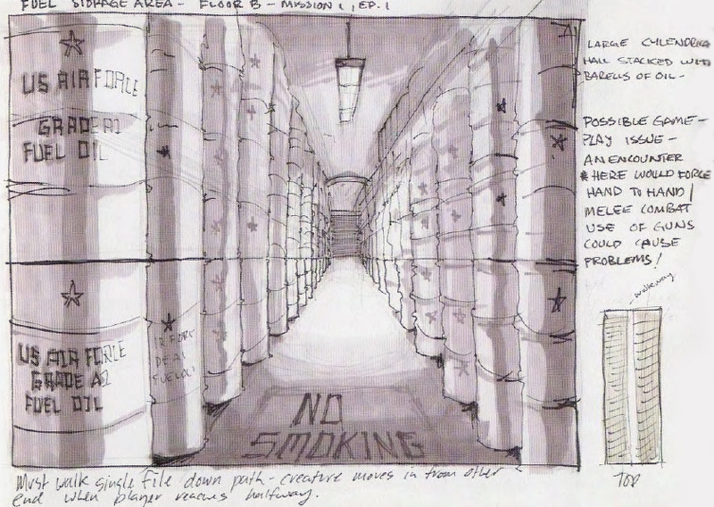
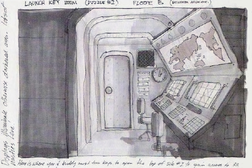
  

  
💎 Steven Universe

  

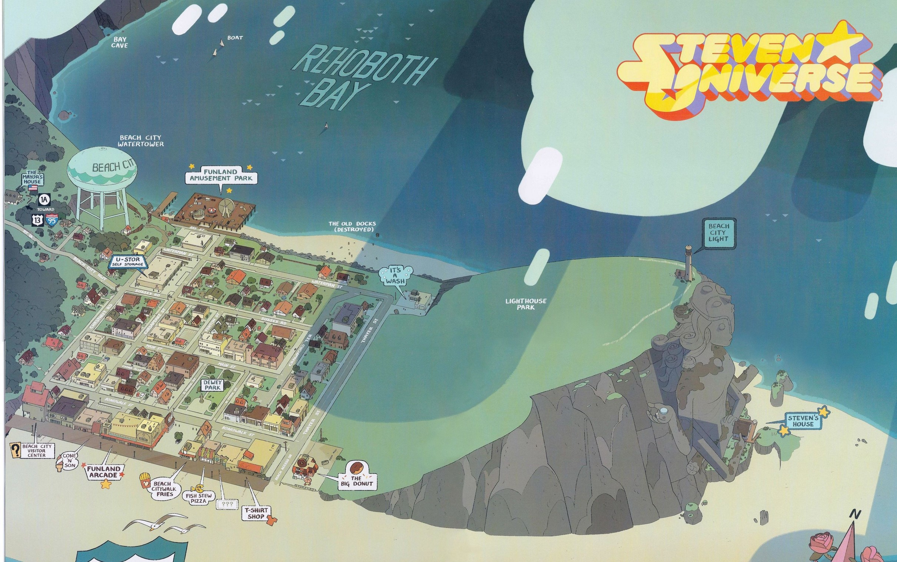
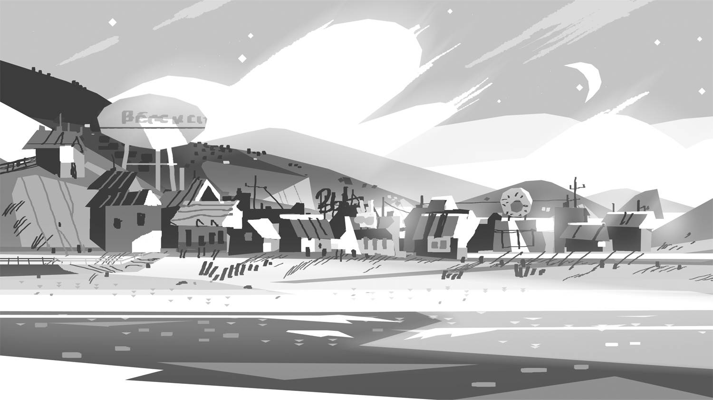
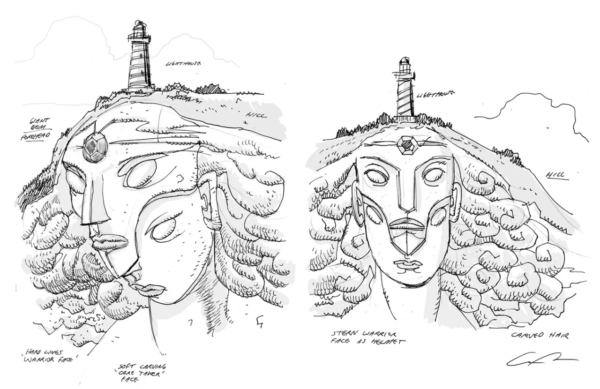
  

### Think about usability
One of the most exciting things to think about now is _how will characters use this space?_

Is the area laid out in a way that makes sense and that real people living in/around the space would lay it out? How will characters interact with the environment you’ve created?

Say you’re designing a house for a character. If they’ve just moved in, the place might be arranged in kinda-clunky ways, or maybe they have a couple of rooms that aren’t being used. If they’ve been in this space for years, they’ve probably had time to arrange furniture in a way that makes a lot of sense for them, and also had time to work out a use for most rooms.

If multiple characters are going to be in the space, think about the main spaces that characters are going to interact in your place. Having a good idea of the ‘high-traffic areas’ can let you focus time and attention on those, and help when you’re working out where the ‘backgrounds’ should be focused on when you’re making those.

### How does this location compare to others in your world?
This is a good chance to compare the locations you’ve already made in this world. Is this new location cohesive or contrasting, compared to those?

---

For example, if you’re designing a living space and you’ve already got a few others designed up in this world… how does this one feel compared to those others? Is it _too similar?_ Maybe it’s _too different to make sense?_

You don’t need to change your design, but now is a good opportunity to think about all this before making the tied-down images.

### Check your details
You need to make sure that artists drawing this location (whether it’s you or someone else) will keep things consistent between this area and others.

Are there certain mountains in the backdrop that people will need to get right? Are there certain landmarks or other locations (maybe a castle) around this location that need to be kept in check? Maybe certain areas in your location will need their own, more specific layout images to show off certain details.

Basically, here’s a great chance to double-check things before you spend time creating fully tied-down images.

## 🖼️ Making tied-down images
Until now, we’ve focused on quick, expendable thumbnails and exploring. Tied-down images of your place are where the definites come in. These images should be worked-out and will be used as the true references for other artists (or yourself) when they want to create backgrounds based here.

These images are similar to the final backgrounds we’ll focus on in other lessons, but… rather than being backgrounds ready for use in a shot, in a panel, or similar, these images show off the elements of the location.

We won’t focus too much on creating interesting shots in this lesson – that’s what the rest of the course is for. These images are about showing off the space and what exists in it, so we’ll add storytelling elements, quirks that explain the characters / space, and even more!

---

This section will be different from the ones above – let’s take a look at [OJ’s](https://twitter.com/ahappypichu/) images **first,** and then dig into why he’s designed the location this way and what these tie-downs convey:

<figure markdown="1">
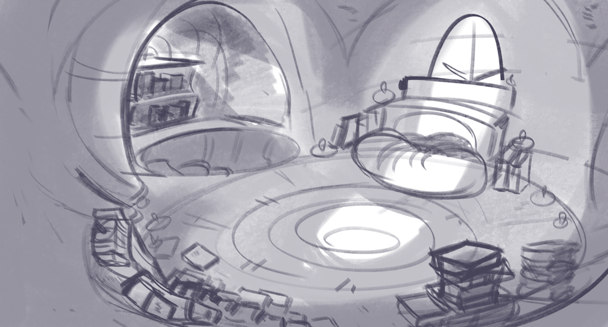
<figcaption>showing off the bedroom / study</figcaption>
</figure>

<figure markdown="1">
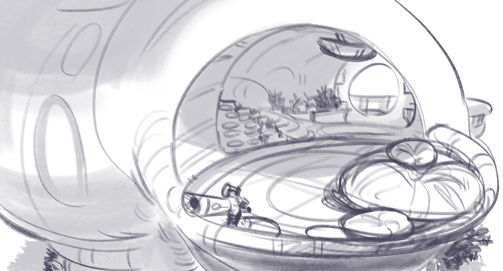
<figcaption>showing off the balcony and stairs leading down into the living room</figcaption>
</figure>

<figure markdown="1">
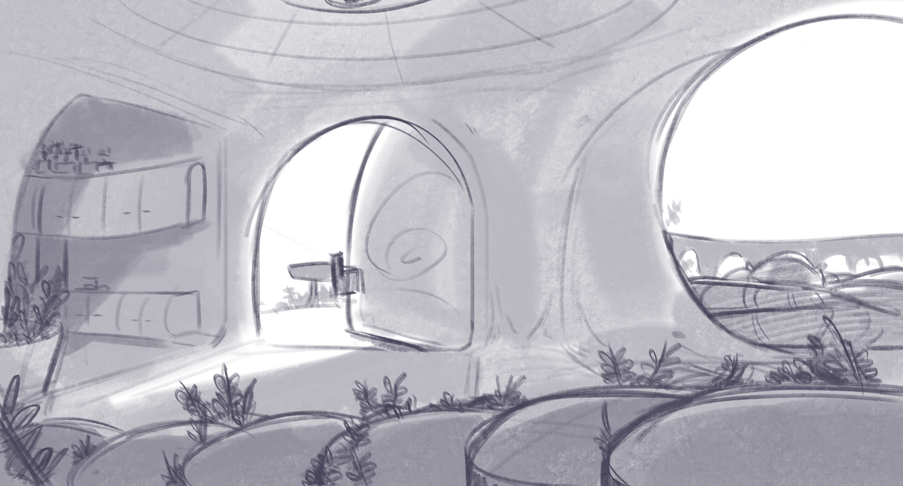
<figcaption>showing off the living room, the kitchen to the left, and the stairs in more detail</figcaption>
</figure>

<figure markdown="1">
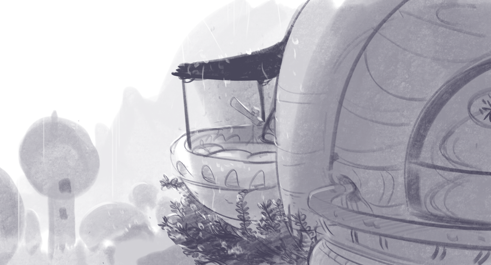
<figcaption>showing off the front door, balcony, and some more stuff in the distance</figcaption>
</figure>

### Answer more questions
Everything should provide context without having to rely on exposition. Basically: the **elements inside** your location will help explain things without words. One of the main reasons for adding detail is to give more context and answer more questions.

---

Let’s describe details we can see in [OJ’s](https://twitter.com/ahappypichu/) images above, and what that can tell us:

- We can see plants growing in the cracks of the stairs, and also what look like plant pots around the corner leading into the kitchen. We can also see what look like wood grain / patterns all throughout the space, including on the door and on the floor of the bedroom.
    - Maybe this living space has been carved out of a big tree?
    - Maybe this character just really likes nature and having nature around, so that’s why they let the plants grow everywhere?
    - Maybe the society that this character’s a part of, or just this town, really values nature?
- There are a lot of books in this character’s bedroom/study… and also a lot of candles in there.
    - This character likes to read? Maybe they’re pretty nerdy? They also have a telescope on their balcony, so that tracks.
    - Given the candles, maybe they like to read at night? Telescopes also usually get used at night, so maybe this character tends to stay up late?
- There’s a lot of plush cushions around. In their bedroom and on the balcony as well.
    - Maybe they like soft things?
    - Maybe when they invite others over, they tend to hang out on the balcony?

---

We’ve all seen those English activities where we have to pull more meaning out of a story than the author intended. But we’re not trying to interpret **the author** here – we’re trying to work out what **the environment** says about **the characters living in it.**

The more questions that you can answer with details in your tied-down drawings, the more there is to find out (which is just fun). And when there are more _subtle_ hints thrown in (maybe some glyphs on the wall or a big one on the floor, a small passageway hidden somewhere, or areas that haven’t been touched in _years_), it’ll be even more interesting.

Viewers are smart. They’ll dig into clues and interpret them – and maybe even argue about how certain clues should be interpreted. You can reward the curious ones by giving them more answers and hints to dig into!

## 🏁 Wrap-up
Here’s an overview of what we’ve learned in this lesson:

---

**Our concept process** - (this isn’t perfect for everyone but it should be a good one to start off with!)
1. Define the problem space.
2. Sketch out ideas with quick thumbnails.
3. Add more interest.
4. Combine your ideas.
5. Sketch a layout of the space, maybe.
6. Think about usability.
7. Check your details.
8. Create your tied-down images.

There’s a lot of steps here, but make this process work **for you!** If this helps you create locations that are interesting and provide extra context without having to rely on words, cool! If it doesn’t, take this process and modify it to suit your needs.

As mentioned at the start, **everyone approaches idea-creation differently,** so experiment to find what works for you.

---

**How to add interest**
- Answer more questions and include hints.
- Do more thumbnails.
- How does your location interact with the surrounding environment?
    - Will your structure stand out from the surroundings or blend into them? Is the structure on a cliff? Maybe there’s a bunch of round trees surrounding the building, while the building itself is very tall and sharp?
- Provide more context.
- Use references.
- Think about shared design elements with other locations in the universe.
- Think about the history of your location.
- Think about the world around your location.
- Treat the world like a character – with its own history and uses – and not as a static backdrop.

## 📚 Readings and resources

### Videos
- [Phils Design Corner - Prop design](https://youtu.be/ZrjaOvenGUk) (the process that Phil goes through here is really exciting)
- Phils Design Corner - Environment design [(part 1)](https://youtu.be/O3FT3i3-qpQ) [(part 2)](https://youtu.be/T67Hsh_y7DI) [(part 3)](https://youtu.be/YA6QRZ63OXo)
- [Trent Kaniuga - What I think about when designing a location](https://youtu.be/7EHH4MtZ5Vs)
- [FZDSCHOOL - Environmental Composition](https://youtu.be/fsQ7eTmR27U)

### Portfolios
- [Chang-Wei Chen - Concept artist](https://www.artstation.com/willischen)
- [Matthias Lechner - Zootopia environment art director](http://www.matthiaslechner.com/zootopia.html)
- [Mikhail Rakhmatullin - Concept artist](https://www.artstation.com/rahmatozz)
- [My Neighbor Totoro storyboards and location art](https://characterdesignreferences.com/art-of-animation-7/art-of-my-neighbor-totoro)
