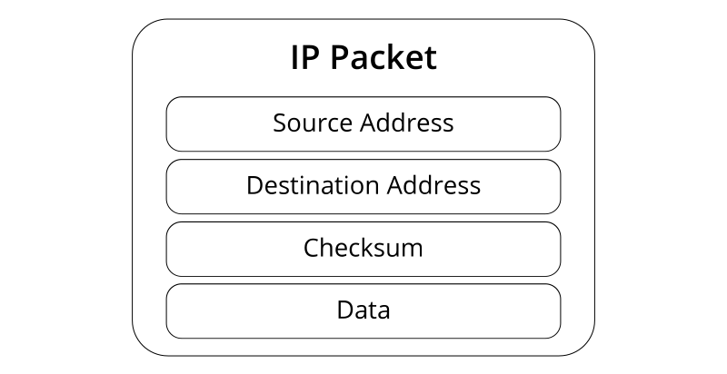

What is the Internet Protocol? Put simply, it is used in every piece of communications that is sent across the internet – from YouTube to Twitter to cute pictures of cats.

IP is used everywhere and runs the internet. This guide should help give you a better understanding of what it is and how it works.

## Packets

Packets are the core blocks used in any sort of internet traffic. Before internet traffic is sent to another computer, it is split into packets, or discrete bits of information.

Packets contain the addresses of the computer that sent them (the source), as well as the computer it's being sent to (the destination). Because of these addresses, the internet can take each packet and separately direct them towards their destination.

Each packet also contains extra information to confirm that the packet is valid, and to make sure that packets can't loop forever in the internet.

We'll go over how a packet's structured after we've talked about the IP overview just below.

---

## IP Model

When talking about the Internet Protocol, it can be useful to think of it in terms of layers.

Here, we'll use the [IP model](https://en.wikipedia.org/wiki/Internet_protocol_suite). If you already understand this and want to dig deeper you can also look at the [OSI model](https://en.wikipedia.org/wiki/OSI_model), which is another useful way to look at IP.

Here are the layers of the IP model:

This covers a rough view of how the internet works, from top to bottom. Let's explain what each layer represents, starting at the bottom (hardware) and moving up to applications (such as Skype or Firefox).

### Link

This layer deals with the low-level sending of data inside a single network, as well as hardware and the communication mechanisms that go into play with it.

For instance, this layer contains the technology behind wifi or the ethernet port on your computer. This layer can also contain things like ethernet cables, fibre-optics and other physical technologies used to transport internet traffic.

For our needs, this layer isn't too important – we generally work from the Internet layer up.

### Internet

This layer deals with sending packets inside a single or between multiple networks. This is where IP addresses are used.

The process of sending a packet between multiple networks is called 'routing', and we'll be going over that in later articles.

IP itself does not define any sort of re-sending traffic if it does not arrive to its destination or other methods of error correction – that's all handled by the protocols built on top of IP in the transport layer.

### Transport

In order to put data over IP, you need to have a format for sending data between computers.

That is, how the data is packaged, and the following questions:

* Does the data delivery always need to be reliable?
* Do comprehensive error-correction mechanisms need to be in place for this data?

This layer is where [UDP and TCP](udptcp) live, and those protocols give application authors further control over their traffic and how it gets delivered. This section also deals with 'port numbers' (which let you run multiple connections to one server at the same time, such as multiple web browser tabs all going to the same site).

### Application

Applications are built on top of the networking stack, to exchange data using IP. This is where things like your web browser, ftp, the `ping` command, as well as network helper services such as DNS live.

Apps use a transport (typically UDP or TCP) to send data over the internet to other machines and services. They are built on top of the other layers which provide a simple, robust interface for sending data with.

---

## Packet Structure

Here is a simplified model of an IP packet, and what each part of it means:

* The source address is the IP address of the computer the packet came from.
* The destination address is the IP address of the computer the packet is being sent to.
* The checksum is used to validate that the packet is correct and has been transmitted without issues.
* The data portion contains the actual information being transmitted. In most cases, this contains the UDP/TCP header and data.

This diagram intentionally leaves out some details. For a more complete look into what exactly packets contain, feel free to look into it [here](http://www.networksorcery.com/enp/protocol/ip.htm).

---

## Overview

* The basic unit of IP is a packet.
* Packets contain a source and destination address, which are used to deliver it.
* IP does not define any sort of error correction or resending data that failed to be delivered.
