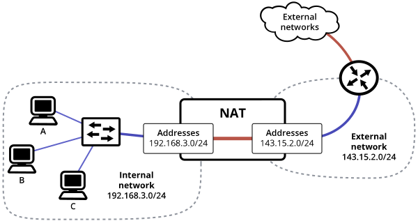
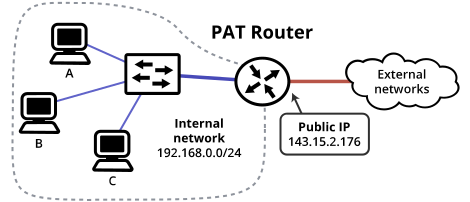
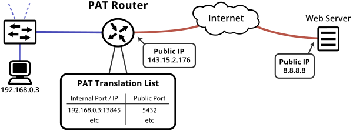

Network Address Translation (NAT) is where routing devices modify IP addresses while transporting packets. The most well-known and used type today is many-to-one NAT, or Port Address Translation (PAT) (or [Network Address Port Translation (NAPT)](https://datatracker.ietf.org/doc/html/rfc2663#section-4.1.2) if you really want).

When talking about the well-used style of NAT, the one you're using at home, I'll say <strong>one-to-many NAT</strong>.

When I say <strong>one-to-one NAT</strong> I'm talking about the old-style 'basic NAT'. This is the type that translates 1:1 between two blocks of address space, and as far as I know isn't really used these days. However, it's described for historical context.

<div class="note">
	<p>NATs are a strange, in-depth concept. If you don't get them at first or they take some time to understand, that's perfectly normal.</p>
</div>


## Public vs Private IP Addresses

When you're looking at standard IP addresses, they can be in the 'public' IP space or the 'private' IP space.

You can think of public IPs as being globally unique. For example, there can only be one host in the world using the IP address `17.0.22.76`, since it's in the public IP space. It makes sense that they need to be unique, since they're the only thing routers pay attention to when sending packets across the internet. Most IP space is public IP space.

There are certain blocks of addresses reserved as 'private IP space'. For example, `10.0.0.0/8` (or `10.0.0.0–10.255.255.255`) and `192.168.0.0/16` (or `192.168.0.0–192.168.255.255`) are both private IP ranges. Private IP space can be used in any way you want. However, packets with a private IP address as the source or destination will get immediately dropped if they're sent out to the internet.

Now the question is, how do you let hosts using private IP addresses talk to hosts using public IP addresses? If I send a packet with a source address of `10.0.0.26` from my computer, the packet will get dropped as soon as it reaches my ISP! Well, that's where NAT comes in.

<div class="advanced">
	<p><strong>Private and Other Addressing Types</strong></p>
    <p>There are some other private IP ranges, namely: &nbsp;&nbsp;&nbsp;<tt>10.0.0.0/8</tt> &nbsp;&nbsp;&nbsp;<tt>172.16.0.0/12</tt> &nbsp;&nbsp;&nbsp;<tt>192.168.0.0/16</tt> &nbsp;&nbsp;&nbsp;<tt>fc00::/7</tt></p>
    <p>And yeah there's other kinds of IP address space such as multicast space, and with anycast routing a single IP can refer to multiple hosts, but this is a very simplified explanation. I feel like the tradeoffs of not describing those details here are fine.</p>
</div>


## One-to-one NAT History

Back in the good ole' days of the internet it was standard practice for businesses to setup their entire network using public IP addresses given to them by their ISP. For example, here's a typical exchange would go like this:

```
Business: Hi ISP, can I please get some IP addresses to use?

ISP: The address space 143.15.2.0/24 is assigned to you. Please pay us.
```

After this, the business would go and setup their internal work machines to use the IP addresses `143.15.2.1-254`.

This is fine. However, if the business had to change ISPs, they had to renumber their entire network to use the new address space assigned to them. When you have hundreds or thousands of computers in your network, changing the address on each one is a pain. So, one-to-one NAT was developed.


## One-to-one NAT

This is the **historical type of NAT** that isn't used much anymore.

These devices have two ports – one is the outside (public) interface, and one is the inside (private) interface. The public and private address ranges are specified, and the device converts addresses as appropriate when sending packets in/out.

This means that when you're moving your corporate network to a new ISP, you can just plug in the new address space on the public side and you don't need to do any renumbering!

-----

Here's an example setup making use of one of these one-to-one NAT devices:



The NAT device is connecting between different address spaces, so it's a router, but it's not acting like a typical everyday router when it sends traffic between the internal and external network. To both sides, it's transparently converting the addresses and looks like a switch.

Let's say that the devices in this diagram have the following addresses:

- **Computer A**: `192.168.3.2`
- **Computer B**: `192.168.3.3`
- **Computer C**: `192.168.3.4`

With this setup, **Computer A** can also be referred to from the public IP address `143.15.2.2`, **Computer B** can also be referred to as `143.15.2.3` and **Computer C** is also `143.15.2.4`.

What the NAT does is:

- On packets coming from the external network, it changes the source/destination addresses from `143.15.2.x` to `192.168.3.x`.
- On packets coming from the internal network, it changes the source/destination addresses from `192.168.3.x` to `143.15.2.x`.

Let's say that the router has the address `143.15.2.1` -- in this network, the computers behind the NAT would see and talk to this router as `192.168.3.1`.

-----

Now that's a complicated setup. However, it does give us what we need. This network has the following properties:

- Computers behind the NAT can use private IP addresses.
- When the public network (`143.15.2.0/14`) changes, the computers behind the NAT can keep the same addresses.

Hooray!

NAT has a 1:1 address space requirement. That is, the internal and external network must be the same size. In this example, both are `/24` networks, so that's true.

However, what if the ISP only gives you a single address, and not a whole range of addresses to use? What if you don't want to spend the money reserving a while range of addresses when one will work just fine? Well, that's where one-to-many NAT (the type we're all familiar with) comes in.


## One-to-many NAT History

One day, a good number of years ago, the designers of the internet noticed a problem. Notably, with the rise of home computers, people were using more and more addresses inside their houses. If there were five devices in someone's house, the ISP needed to provide them with five public IP addresses to use.

Now this doesn't sound too bad, but when you're dealing with millions of new homes connecting to the Internet, addresses start to get used up very quickly.

For one-to-one NAT, for every private address you use, you need one public address. One-to-many NAT reduces the number of required public addresses, and makes it so that for every public address, you can have thousands of machines on private addresses.

## One-to-many NAT

This is the type of NAT that we all use and we're all familiar with today. If you hear someone mention NAT, they're almost definitely talking about this type.

There's a lot of alternate names for this type of NAT: Port Address Translation (PAT), Network Address Port Translation (NAPT), NAT overload... There's actually [an RFC](https://datatracker.ietf.org/doc/html/rfc2663) that describes different terminology around NAT, which is worth a look. To be more specific, the diagrams here will refer to the one-to-many devices as 'PAT routers'.

-----

Let's take a look at an example network using a NAT router:



One-to-many NAT happens on routers. The devices on the internal network send their traffic to the router, and the router changes the source internal IP address to the public IP address `143.15.2.176`. When traffic comes in from external networks, the router changes the destination IP address from `143.15.2.176` to the appropriate internal address, and sends it on to the internal network.

The question now is: When packets come in destined to the public IP `143.15.2.176`, how does the router know which internal device the packet is meant to be sent to?

The process that packets go through here is port address translation (PAT).


### How Port Address Translation Works

Let's take a look specifically at how PAT changes incoming and outgoing traffic. The diagram below is meant to represent a connection between the host `192.168.0.3` and the server `8.8.8.8`:




#### Outgoing Traffic

When the NAT router gets a packet from the internal network destined for outside, the gateway looks at the source IP address and source port of that packet.

For that source IP/port, the gateway generates a random UDP/TCP port on the public IP address to represent that connection, and stores it in an internal list. If it already has an entry in its' list for that internal IP/port, it uses that existing public port.

The NAT router changes the source IP address from the internal IP to its' public IP, and the source port from the original port to the public port it allocated for that connection.

For example, let's say that a packet comes from `192.168.0.3:13845` and is being sent to `8.8.8.8:80`. The router says _"I don't have an entry for packets coming from `192.168.0.3:13845`"_ and allocates public port `5432` for it. Whenever the router sees a packet from `192.168.0.3:13845`, it will change the source IP address to `143.15.2.176`, change the source port to `5432`, and send the packet on its' way.


#### Incoming Traffic

When a packet comes in to its' public IP, it checks the destination port. If it has an existing public port - internal IP/port mapping in its list, it changes the addresses and sends it through.

Continuing from our example above, let's say that a packet comes from `8.8.8.8:80` being sent to `143.15.2.176:5432`. In this case, the router has a record that public port `5432` means the internal IP/port `192.168.0.3:13845`. As such, it changes the destination IP address to `192.168.0.3`, changes the destination port to `13845`, and then sends the packet to the internal network.


### One-to-many NAT Overview

So a one-to-many NAT network has the following properties:

- Computers behind the NAT can use private IP addresses
- The entire network behind the NAT can use one public IP address for connectivity to the Internet.

Whereas one-to-one NAT requires one public address per address on the internal network, one-to-many NAT requires one public port per connection from an internal IP+port.

<div class="advanced">
	<p><strong>Larger NAT Devices and Carrier-Grade NAT</strong></p>
    <p>Larger NAT devices can also use more than one external IP address. These devices act in exactly the same way as described here, but extend the PAT translation table to store both <strong>Internal IP/Port</strong> and <strong>Public IP/Port</strong>.</p>
    <p>Many ISPs also implement something called "Carrier-Grade NAT", or CGN/CGNAT. What the ISP does is run a large router with this type of NAT themselves, and then only provide private IP addresses to their clients. You will see this especially often with 3G/4G phone connections, where if you look into your phone's network settings you're provided with a private <tt>10.X.X.X</tt> address directly from your carrier.</p>
</div>


#### Security

A one-to-many NAT device acts as an unintentional firewall. Basically, having this type of NAT in the way means that almost all ports on the public IP address won't be able to reach an actual computer on the internal network. This can prevent the majority of bad stuff out on the internet from trying to reach the devices on the internal network.


#### Port Forwarding

Let's say that `192.168.0.3` wants to host a public server. By default, it can't. This is because there is no static, public IP that goes to it.

However, NAT routers let you add 'forwarded ports'. Essentially, you can manually add an entry to the PAT translation table that is always present. So if you add a port-forwarding entry into the router for:
```
 Internal IP/Port  |  Public Port
-------------------|--------------
  192.168.0.3:80   |      80
```
then sending a packet to `143.15.2.176:80` always results in it being sent to `192.168.0.3:80`, meaning that internal machine can host a publicly-accessible server on that port!

<div class="advanced">
	<p><strong>Bypassing NAT</strong></p>
    <p>NAT restricts you in that you can't host a publicly-accessible server. As such, NAT breaks a lot of programs that depend on being able to send P2P traffic (often used in audio/video calls such as Skype). If one or both clients are behind a NAT, they don't have public addresses to contact each other on easily.</p>
    <p>Because NAT breaks P2P traffic, there have been workarounds created to get around it. Generally, a public server sits between the two devices who want to connect directly. Each of them contacts the public server, which creates a link between the public port and their internal IP/Port and the public port.</p>
    <p>Let's take the example of Computer A and Computer B, both sitting behind NAT, that want to communicate with each other. Computer A can't reach out to Computer B because it's behind NAT, and vice-versa.</p>
    <p>However, both of them can reach the public server in the middle, and the public server will see the public IP/port that does directly to each machine that contacts it. Both machines contact the server, and the server now has the public IPs/ports of both machines, as well as an open connection to each.</p>
    <p>The public server tells computer A the public IP/Port it uses to contact computer B, and tells computer B the public IP/Port it uses to contact computer A.</p>
    <p>After this, both machines simply start sending traffic towards the public IP/port of the other machine, and can now communicate P2P despite the fact that they're both behind NATs. Neat, huh?</p>
    <p>(Take a look at the <a href="https://en.wikipedia.org/wiki/Hole_punching_(networking)">Wikipedia article on hole punching</a> for more information on this technique, and a less simplified version than was described here)</p>
</div>


## Overview

- One-to-many NAT is the type of NAT that's widely used today.
- Whenever you hear NAT, people are usually talking about devices that are doing port address translation.

#### One-to-many NAT

- NAT routers store a list of internal IP/port to public ports.
- When the first instance of an IP/port goes out a NAT router, it allocates a specific public port to be translated to that internal IP/port.
- When packets go through a NAT router, the source/destination IP and port are adjusted to suit.

#### Port Forwarding

- Port forwarding ensures that a specific public port is always forwarded to a specific internal IP/port.
- If a device is behind NAT, it will not be able to host public servers unless there is a port forwarded for it.
